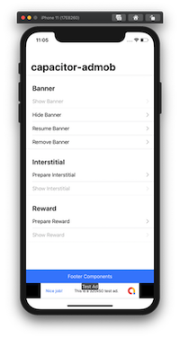
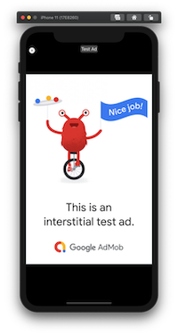

[](https://badge.fury.io/js/%40capacitor-community%2Fadmob)
<!-- ALL-CONTRIBUTORS-BADGE:START - Do not remove or modify this section -->
[](#contributors-)
<!-- ALL-CONTRIBUTORS-BADGE:END -->

# @capacitor-community/admob
Capacitory community plugin for AdMob.

## Maintainers

| Maintainer | GitHub  | Social | Sponsoring Company |
| --- | --- | --- | --- |
| Masahiko Sakakibara  | [rdlabo](https://github.com/rdlabo)  | [@rdlabo](https://twitter.com/rdlabo) | RELATION DESIGN LABO, GENERAL INC. ASSOCIATION |
 
Mainteinance Status: Actively Maintained

## Demo
[Demo code is here.](https://github.com/capacitor-community/admob/tree/master/demo)

### Screenshots
|  | Banner | Interstitial | Reward |
|:-----------------|:------------------:|:------------------:|:------------------:|
| **iOS** |  |  |  |
| **Android** |  |  |  |

## Installation
__Supporting iOS14 is be since @1.1.0.__

```
% npm install --save @capacitor-community/admob
% npx cap update
```

### If you use Capacitor 1.x
```
% npm install --save @rdlabo/capacitor-admob@0.3.0
% npx cap update
```

## Android configuration

In file `android/app/src/main/java/**/**/MainActivity.java`, add the plugin to the initialization list:

```java
this.init(savedInstanceState, new ArrayList<Class<? extends Plugin>>() {{
  [...]
  add(com.getcapacitor.community.admob.AdMob.class);
  [...]
}});
```

In file `android/app/src/main/AndroidManifest.xml`, add the following XML elements under `<manifest><application>` :

```xml
<meta-data
 android:name="com.google.android.gms.ads.APPLICATION_ID"
 android:value="@string/admob_app_id"/>
```

In file `android/app/src/main/res/values/strings.xml` add the following lines :

```xml
<string name="admob_app_id">[APP_ID]</string>
```

Don't forget to replace `[APP_ID]` by your AddMob application Id.


## iOS configuration
Add the following in the `ios/App/App/info.plist` file inside of the outermost `<dict>`:

```xml
<key>GADIsAdManagerApp</key>
<true/>

<key>GADApplicationIdentifier</key>
<string>[APP_ID]</string>

<key>NSUserTrackingUsageDescription</key>
<string>[Why you use NSUserTracking. ex: This identifier will be used to deliver personalized ads to you.]</string>
```

Don't forget to replace `[APP_ID]` by your AddMob application Id.


## Initialize

```
initialize(options: { requestTrackingAuthorization?: boolean }): Promise<{ value: boolean }>
```

You can use option `requestTrackingAuthorization`. This change permission to requrire  `AppTrackingTransparency` in iOS >= 14:
https://developers.google.com/admob/ios/ios14

Default value is `true`. If you don't want to track, set requestTrackingAuthorization `false`.


### Initialize for @ionic/angular

Open our Ionic app __app.component.ts__ file and add this folloing code.

```ts
import { Plugins } from '@capacitor/core';
const { AdMob } = Plugins;

@Component({
  selector: 'app-root',
  templateUrl: 'app.component.html',
  styleUrls: ['app.component.scss']
})
export class AppComponent {
  constructor() {
    // Initialize AdMob for your Application
    AdMob.initialize();
  }
}
```

### Initialize for @ionic/react

This is implements simple sample from https://github.com/DavidFrahm . Thanks!

```ts
import React from 'react';
import { Redirect, Route } from 'react-router-dom';
import { IonApp, IonRouterOutlet, isPlatform } from '@ionic/react';
import { IonReactRouter } from '@ionic/react-router';
import Home from './pages/Home';

import { Plugins } from '@capacitor/core';
import { AdOptions, AdSize, AdPosition } from '@capacitor-community/admob';
const { AdMob } = Plugins;

const App: React.FC = () => {

  AdMob.initialize();

  const adId = {
    ios: 'ios-value-here',
    android: 'android-value-here'
  }

  const platformAdId = isPlatform('android') ? adId.android : adId.ios;

  const options: AdOptions = {
    adId: platformAdId,
    adSize: AdSize.BANNER,
    position: AdPosition.BOTTOM_CENTER,
    margin: 0,
    // isTesting: true
  }

  AdMob.showBanner(options);

  // Subscribe Banner Event Listener
  AdMob.addListener('onAdLoaded', (info: boolean) => {
    console.log("Banner ad loaded");
  });

  // Get Banner Size
  AdMob.addListener('onAdSize', (info: boolean) => {
    console.log(info);
  });

  return (
    <IonApp>
      <IonReactRouter>
        <IonRouterOutlet>
          <Route path="/home" component={Home} exact={true} />
          <Route exact path="/" render={() => <Redirect to="/home" />} />
        </IonRouterOutlet>
      </IonReactRouter>
    </IonApp>
  );

};

export default App;
```


## APIs

### BANNER

#### showBanner(options: AdOptions): Promise<{ value: boolean }>

```ts
import { Plugins } from '@capacitor/core';
import { AdOptions, AdSize, AdPosition } from '@capacitor-community/admob';
const { AdMob } = Plugins;

@Component({
  selector: 'admob',
  templateUrl: 'admob.component.html',
  styleUrls: ['admob.component.scss']
})
export class AdMobComponent {

  private options: AdOptions = {
      adId: 'YOUR ADID',
      adSize: AdSize.BANNER,
      position: AdPosition.BOTTOM_CENTER,
      margin: 0,
  }

  constructor() {
       // Show Banner Ad
       AdMob.showBanner(this.options);

        // Subscibe Banner Event Listener
        AdMob.addListener('onAdLoaded', (info: boolean) => {
             console.log("Banner Ad Loaded");
        });

        // Get Banner Size
        AdMob.addListener('onAdSize', (info: boolean) => {
             console.log(info);
        });
    }
}
```


#### hideBanner(): Promise<{ value: boolean }>

```ts
// Hide the banner, remove it from screen, but can show it later
AdMob.hideBanner();
```


#### resumeBanner(): Promise<{ value: boolean }>

```ts
// Resume the banner, show it after hide
AdMob.resumeBanner();
```

#### removeBanner(): Promise<{ value: boolean }>

```ts
// Destroy the banner, remove it from screen.
AdMob.removeBanner();
```

#### Event Listener
This following Event Listener can be called in **Banner AD**.
```ts
addListener(eventName: 'onAdLoaded', listenerFunc: (info: any) => void): PluginListenerHandle;
addListener(eventName: 'onAdFailedToLoad', listenerFunc: (info: any) => void): PluginListenerHandle;
addListener(eventName: 'onAdOpened', listenerFunc: (info: any) => void): PluginListenerHandle;
addListener(eventName: 'onAdClosed', listenerFunc: (info: any) => void): PluginListenerHandle;
addListener(eventName: 'onAdSize', listenerFunc: (info: any) => void): PluginListenerHandle;
```


### INTERSTITIAL

#### prepareInterstitial(options: AdOptions): Promise<{ value: boolean }>
```ts
import { Plugins } from '@capacitor/core';
import { AdOptions } from '@rdlabo/capacitor-admob';
const { AdMob } = Plugins;

@Component({
  selector: 'admob',
  templateUrl: 'admob.component.html',
  styleUrls: ['admob.component.scss']
})
export class AppComponent {
    const options: AdOptions = {
        adId: 'YOUR ADID',
        autoShow: false
    }

    constructor(){
        // Prepare interstitial banner
        AdMob.prepareInterstitial(this.options);

        // Subscibe Banner Event Listener
        AdMob.addListener('onAdLoaded', (info: boolean) => {
            // You can call showInterstitial() here or anytime you want.
             console.log("Interstitial Ad Loaded");
        });
    }
}
```


#### showInterstitial(): Promise<{ value: boolean }>

```ts
// Show interstitial ad when it’s ready
AdMob.showInterstitial();
```

#### Event Listener
This following Event Listener can be called in **Interstitial AD**
```ts
addListener(eventName: 'onInterstitialAdLoaded', listenerFunc: (info: any) => void): PluginListenerHandle;
addListener(eventName: 'onInterstitialAdFailedToLoad', listenerFunc: (info: any) => void): PluginListenerHandle;
addListener(eventName: 'onInterstitialAdOpened', listenerFunc: (info: any) => void): PluginListenerHandle;
addListener(eventName: 'onInterstitialAdClosed', listenerFunc: (info: any) => void): PluginListenerHandle;
addListener(eventName: 'onInterstitialAdLeftApplication', listenerFunc: (info: any) => void): PluginListenerHandle;
```


### RewardVideo

#### prepareRewardVideoAd(options: AdOptions): Promise<{ value: boolean }>

```ts
import { Plugins } from '@capacitor/core';
import { AdOptions } from '@rdlabo/capacitor-admob';
const { AdMob } = Plugins;

@Component({
  selector: 'admob',
  templateUrl: 'admob.component.html',
  styleUrls: ['admob.component.scss']
})
export class AdMobComponent {
    const options: AdOptions = {
        adId: 'YOUR ADID'
    }

    constructor(){
        // Prepare ReWardVideo
        AdMob.prepareRewardVideoAd(this.options);

        // Subscibe ReWardVideo Event Listener
       AdMob.addListener('onRewardedVideoAdLoaded', (info: boolean) => {
            // You can call showRewardVideoAd() here or anytime you want.
            console.log("RewardedVideoAd Loaded");
        });
    }
}
```


#### showRewardVideoAd(): Promise<{ value: boolean }>

```ts
// Show a RewardVideo AD
AdMob.showRewardVideoAd();
```


#### pauseRewardedVideo(): Promise<{ value: boolean }>

```ts
// Pause a RewardVideo AD
AdMob.pauseRewardedVideo();
```


#### resumeRewardedVideo(): Promise<{ value: boolean }>

```ts
// Resume a RewardVideo AD
AdMob.resumeRewardedVideo();
```

#### stopRewardedVideo(): Promise<{ value: boolean }>

```ts
// Stop a RewardVideo AD
AdMob.stopRewardedVideo();
```

#### Event Listener
This following Event Listener can be called in **RewardedVideo**
```ts
addListener(eventName: 'onRewardedVideoAdLoaded', listenerFunc: (info: any) => void): PluginListenerHandle;
addListener(eventName: 'onRewardedVideoAdOpened', listenerFunc: (info: any) => void): PluginListenerHandle;
addListener(eventName: 'onRewardedVideoStarted', listenerFunc: (info: any) => void): PluginListenerHandle;
addListener(eventName: 'onRewardedVideoAdClosed', listenerFunc: (info: any) => void): PluginListenerHandle;
addListener(eventName: 'onRewarded', listenerFunc: (info: any) => void): PluginListenerHandle;
addListener(eventName: 'onRewardedVideoAdLeftApplication', listenerFunc: (info: any) => void): PluginListenerHandle;
addListener(eventName: 'onRewardedVideoAdFailedToLoad', listenerFunc: (info: any) => void): PluginListenerHandle;
addListener(eventName: 'onRewardedVideoCompleted', listenerFunc: (info: any) => void): PluginListenerHandle;
```

## Options

### AdOptions
```ts
interface AdOptions {
  adId: string;
  adSize?: AdSize;
  position?: AdPosition;
}
```

### AdSize
```ts
enum AdSize {
  BANNER = 'BANNER',
  FLUID = 'FLUID',
  FULL_BANNER = 'FULL_BANNER',
  LARGE_BANNER = 'LARGE_BANNER',
  LEADERBOARD = 'LEADERBOARD',
  MEDIUM_RECTANGLE = 'MEDIUM_RECTANGLE',
  SMART_BANNER = 'SMART_BANNER',
  CUSTOM = 'CUSTOM'
}
```

### AdPosition
```ts
enum AdPosition {
  TOP_CENTER = 'TOP_CENTER',
  CENTER = 'CENTER',
  BOTTOM_CENTER = 'BOTTOM_CENTER',
}
```

## TROUBLE SHOOTING

### If you have error:

> [error] Error running update: Analyzing dependencies
[!] CocoaPods could not find compatible versions for pod "Google-Mobile-Ads-SDK":

You should run `pod repo update` ;

## License

Capacitor AdMob is [MIT licensed](./LICENSE).

## Contributors ✨

Thanks goes to these wonderful people ([emoji key](https://allcontributors.org/docs/en/emoji-key)):

<!-- ALL-CONTRIBUTORS-LIST:START - Do not remove or modify this section -->
<!-- prettier-ignore-start -->
<!-- markdownlint-disable -->
<table>
  <tr>
    <td align="center"><a href="https://wako.app"><br /><sub><b>Jean-Baptiste Malatrasi</b></sub></a><br /><a href="https://github.com/capacitor-community/admob/commits?author=JumBay" title="Code">💻</a></td>
    <td align="center"><a href="https://github.com/gant02"><br /><sub><b>gant02</b></sub></a><br /><a href="https://github.com/capacitor-community/admob/commits?author=gant02" title="Code">💻</a></td>
  </tr>
</table>

<!-- markdownlint-enable -->
<!-- prettier-ignore-end -->
<!-- ALL-CONTRIBUTORS-LIST:END -->

This project follows the [all-contributors](https://github.com/all-contributors/all-contributors) specification. Contributions of any kind welcome!
